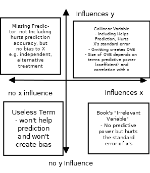

```{r setup, include=FALSE}
knitr::opts_chunk$set(echo = TRUE)
```

# Notes for Week 8

Exam Chapters 4,5 and 6 (Homework 3,4 and 5)

- If performing an F test for one variable, you can check your answer with t-test from the unrestricted regression.

- Jarque-Bera is, under the null that the errors are normal, distributed according to a chi-squared distribution with 2 degrees of freedom ($\chi^2(2)$). The two degrees of freedom is because the statistic is the sum of two squared normals under the null ($S^2$ and $(K - 3)^2$). (You may recall from econ 41 that a chi-squared distribution with n degrees of freedom can be constructed as the sum of n independent normal random variables). Rejecting the null means, given the data, the errors are unlikely to be normally distributed.

- If $\hat{y_n}$ denotes the natural predictor, we can define the generalized $R^2$ for the log-linear model as $R_g^2:= r_{y\hat{y_n}}^2$ This is in contrast to the standard $R^2$, mentioned above, which would be $R^2 = r_{log y, \widehat{\log}(y)}^2$. Further note that $$corr(aX, Y)= \frac{cov(aX, Y)}{\sqrt{var(aX) var(Y)}} = \frac{a cov(X, Y)}{|a| \sqrt{var(X) var(Y)}} = sign(a) corr(X, Y)$$ where $$sign(a) = \begin{cases} 1 \text{ if } a > 0 \\ 0 \text{ if } a = 0 \\ - 1 \text{ if } a < 0 \end{cases}$$ Finally, we can therefore conclude, that since $e^{\hat {\sigma}^2/2} y_n = y_c$ and $e^{\hat {\sigma}^2/2} > 0$, that $corr(\hat{y}_n, y) = corr(\hat{y}_c, y)$ and so $R_g^2 = r_{y, \hat{y_n}}^2 = r_{y, \hat{y_c}}^2$ for the linear and log-linear models.

Model Selection: 

- Higher $R^2$ because larger means explaining more variation in outcome variable
- Higher adjusted $R^2$ (denoted $\bar{R}^2$), which tries to account for advantage larger models have. (will always improve if t-stat from added variable is larger in absolute value than 1)
- $\bar{R}^2 = 1 - \frac{SSE \times (N - 1)}{SST \times (N - K)}$ adjusted R squared. Bigger is better. It rescales the term being subtracted by $\frac{N - 1}{N - K}$. Note, since $N - 1 > N - K$, subtracting a bigger number, so $R^2 \ge \bar{R}^2$. The more parameters in your model, the larger the fraction $\frac{N - 1}{N - K}$ but also the lower your $SSE$. Fact: $\bar{R}^2$ will increase with one more coefficient if that coefficients t-value is greater than 1 (vs 2 for two-sided .95 confidence when N large). Therefore, interpreting it as model selection not always best idea. 

AIC and BIC/SC - smaller (or more negative) is better (for both).

RESET - include $\hat{y}^k$ for k = 2, 3, ... in your model. Test the regression coefficients of your $\hat{y}^k$ using F-test vs model without $\hat{y}^k$ term. If reject F-test null (that all $\hat{y}^k$ coefficients are zero), then your model is "not adequate".

# Collinearity

- Note, having collinearity isn't necessarily a problem. It's only a problem because you will get poorer variance estimates of coefficients.
- When you have (non-perfect) collinearity, inclusion or exclusion of some regressors will strongly influence coefficient estimates. 
- To test for collinearity between two variables x and z, you can look at their correlation.
- To test for collinearity between three or more (explanatory/independent) variables, $x_1, x_2, x_3$, etc., regress $x_1$ on $x_2$ and $x_3$ and then $x_2$ on $x_1$ and $x_3$, etc. $R^2$ in these regressions above .80 suggest collinearity. This is called "auxiliary regressions"
- An alternative way to report these auxilary regression is with VIF (Variance Inflation Factors). See a VIF example in 6.22 part (f) from last week's lecture notes, or from your class notes. To understand the relationship between VIF and auxilary regressions, consider the auxilary regression of $x_1$ on $x_2, x_3, \dots, x_K$ where $x_K$ is the last regressor. Let $R_1^2$ be the R squared from this regression. Then $VIF_1 = \frac{1}{1 - R_1^2}$. We can calculate this for each auxilary regression 1 to K. A high $R^2$ is greater than .8. A high VIF comes from an $R^2$ greater than .8. So a high VIf would be bigger than or equal to $\frac{1}{1 - .8} = 5$

# $R^2$

with two term regression (that is, with just a constant and coefficient on scalar x explaining y), $R^2 = r_{xy}^2 = \frac{s_{xy}}{s_x s_y}$ where $r_{xy}$ is the estimated correlation between x and y, which is the estimated covariance of x and y $s_{xy}$ divided by the standard errors. With more terms, $R^2 = r_{y \hat{y}}$

# Problems from Changing Scale of x, y

You can infer all the answers from the formulas on the formula sheet:

$b_2 = \frac{\sum (x_i - \bar{x})(y_i - \bar{y})}{\sum (x_i - \bar{x})^2}$
and 
$b_1 = \bar{y} - b_2 \bar{x}$
or just memorize the rules from the book page 140.

For example, if x is replaced by $x^\star = 5x$, then trivially $\bar{x}^\star = 5 \bar{x}$ and $b_2$ turns into
$$b^\star_2 = \frac{\sum (5x - 5\bar{x})(y_i - \bar{y})}{\sum (5x - 5 \bar{x})^2} = \frac{5 \sum (x_i - \bar{x})(y_i - \bar{y})}{25 \sum (x_i - \bar{x})^2} = \frac{1}{5} b_2$$ and $$b_1 = \bar{y} - b_2^\star \bar{x}^\star = \bar{y} - \frac{1}{5} b_2 (5 \bar{x}) = \bar{y} - b_2 x$$
That is, the new $b_2$ is 1/5 the old $b_2$ and the new $b_1$ is the same as the old $b_1$.

Similarly, if multiply the y's by 5 such that $y^\star = 5y$, without changing the x's, then $$b^\star_2 = \frac{\sum (x - \bar{x})(5y_i - 5\bar{y})}{\sum (x - \bar{x})^2} =  5 b_2$$ and $$b_1 = \bar{y^\star} - b_2^\star \bar{x} = 5 \bar{y} - 5 b_2 (\bar{x}) = 5(\bar{y} - b_2 x)$$
That is, the new $b_1$ and $b_2$ are both just rescaled by 5.

You can plug these formulas into the formulas for $t$ statistics and $R^2 values$ to see these won't change under rescalings. And since t statistics aren't changing, p values don't change either.


# Equations can you get from output table?


- $SST = SSE + SSR$
- $SST = \sum (y_i - \bar{y})^2$ (Total Variation)
- $SSR = \sum (\hat{y}_i - \bar{y})$ Sum of Squared Regression (explained variation)
- $SSE = \sum \hat{e}_i^2 = \sum (y - \hat{y}_i)^2$ (Unexplained Variation)

Note, in this table:
- SSR = $2.41 \times 10^{10}$
- SST = $4.282 \times 10^{10}$
- SSE = $1.86 \times 10^{10}$


- F(3, 502) refers to the f statistic of the model versus a constant. Prob > F refers to the p value of this F statistic. A low p-value (below .05) suggests the model does a statistically significantly better job at explaining the model's variation than the job a constant would. (i.e., a large p-value says your model is garbage, you can't even beat a constant's predictive value in a statistically significant way) 

- Root $MSE = \sqrt{\frac{1}{N - K} SSE} = \hat{\sigma}$

- Of course, $N =$ is the number of observations (upper right) and counting the coefficients in the regression gets you $K$

- Note that the t-statistics tells you the answer to F-statistics where restrict just that single coefficient. For example, the F statistic for the hypothesis of removing rooms would be $(19.44)^2$ and it's p-value would be 0.000. This only works when testing to remove 1 term.

- There are also the coefficient, standard error, t-value, p-value and confidence interval relationships learned for the first exam in this table.


# Omitted Variable Bias

- If $y = \beta_1 + \beta_2x_2 + \beta_3 x_3 + e$, but you don't include $x_3$ in the regression, and just regress to get $y = b_1 + b_2 x_2$, then $bias(b_2) = E(b_2) - \beta_2 = \beta_3 \frac{\widehat{cov(x_2, x_3)}}{\widehat{var}(x_2)} = \beta_3 \frac{r_{x_2, x_3}}{\hat{\sigma_2}^2}$. So the sign of the bias depends on the (unknown but estimatable if you have x_3) true coefficient $\beta_3$ and the sign of the sample correlation of $x_2$ and $x_3$. Variance is always positive so doesn't affect the sign


```{bash, eval = F, echo = F}
# Irrelevant Vars

Note that the book's discussion of irrelevant variabless is specifically around variables that are irrelevant for determining y *but correlated with the x's*. If you added random information to your regression, the results discussed in the book wouldn't necessarily hold. So, the logic would be similar to a story of regressing trying to predict surfers in a coastal area with the regression $Number Surfers$ on $Average Wave Height$ and $Number of Beach Goers$ and $Average Temperature$, then you decide to add in $Distance from Michigan$. Distance from Michigan will most likely be positively correlated with surfing (at least, if limit study to US), since most surfers are in Hawaii, Florida or California, with fewer on the east coast or Pacific Northwest. It will also be positively correlated with average temperature (larger distance gets you to warmer places). But, it's irrelevant. There's nothing special about michigan that should make you more likely to have surfers if you live farther from there.

The book is focused more on vars with low p-values that get included in the regression. They will take explanatory power from the variables that they are correlated with (i.e. lower the precision of the variables they are correlated with), even though they are not relevant for predicting y.

I will add this is a complicated issue, and often researchers stick irrelevant variables in regressions to try to control for data they lack. For example, if you couldn't get average temperature in the above story, you may use distance from michigan as a proxy for average temperature. This may not be the worst idea if you don't have the data, but interpretation is tricky! This paragraph is beyond the scope of the class.
```

# New Code
```{bash, eval = F}
nlcom (vs lincom)
  - performs delta-method test on nonlinear combo
  of variables
test 
  - performs an F test on the listed variables.
estat vce
  - to get covariance matrix of recent regressors
corr 
  - to get correlation matrix of recent regressors
  - can specify only certain values, like correlate wage yhatn yhatc
  - on page 150
  
reg y c.x1## c.x2 
  - ## is the same as reg y x1 x2 c.x1#c.x2

ttail(df, t1)
  - prob of t random var with degrees of freedom df is larger than t1

invttail(df, 05)
  - finds quantile t1 such that prob to the *right* of t1 is .05

chi2tail(2, jb) //page 137
  - to get pvalue to the right of chi squared at jb
invchi2tail(2, 05) //page 136
  - to get cutoff value jb such that .05 to the right of chi squared
  - of degrees of freedom 2.

Ftail(J, N-k, fstat)

invFtail(J,N_K, alpha)

cnsreg
  - regression where add (linear) constraints 

predict yhat 
  - predicts dependent variable at all x values in table, calls
  - that predicted vector yhat
  - same as predict yhat, xb (xb is default option)
predict ehat, residuals
  - calculates the residuals at all x values in table, calls ehat
predict expectvalse, stdp
  - calculates standard error of predicted values at all points
  - this is variance of, for example se(b_1 + 3 b_2) if 
  - x = 3 is in our table
  - think of as standard error for average
  - stores standard errors in expectvalse (can use different name)
predict sef, stdf
  - predicts standard forecast errors at all x values in table
  - stores these predicted variables in variable called sef
  - (note, each point has its own forecast standard error,
  - giving N forecast standard errors (see the formula has x in it)
  - vs each coefficient estimate (e.g b_2) has only 1 standard error)
  - standard forecast error larger than prediction standard errors!
  - can see this in formula
estat ovtest 
  - does REST test, including yhat^2, yhat^3 and yhat^4
    to the regression
r(skewness) //page 136
  - r() gets results from general commands
  - vs e() gets results from estimation commands
  - vs s() from parsing commands, see later

// to see all possible, type
return list
ereturn list
sreturn list
// if see in code e(blah) or r(blah), just pulling a stored value

e(rss) - sum of squared residuals (SSE not SSR!)
e(rmse) - root mean sqared error (Root MSE)
e(r2) - R squared value
e(r2_a) - adjusted R squared

_se[varname] //to get se of variable named varname
_b[varname] // to get estimate of variabled named varnamed
  
margins, dydx(advert) at(atvert = .5 2) 
  - to estimate and CI for how y changes with respect to advert
  - at .5 and at 2
  - if no "at", then does at average advert, average all other vars
  - if advert replaced with *, calculates for all dependent vars
  - vs margins, eyex(advert) from chapter 2, computes elasticities


rvpplot
  - residual vs predictor plot
  - many
  
twoway lfit
  - calculates prediction for yvar from yvar on xvar, plots fitted line

i. #to specify a variable is an indicator
c. #to specify a variable is to be created as continuous
    
## example 
regress mpg cyl eng wgt // p.204
test cyl eng //does joint test that cyl = 0 and eng = 0

##
reg sales price advert a2 //page 180
nlcom (1 - _b[advert])/(2*_b[a2])
  // tests if 1 minus coefficient of advert divided by twice
  // the coefficient of a2 is different from 0
  
//vs 
lncom -.4*price + .8*advert, level(90) //page 179
  //tests if price coefficient = 2*advertising coefficient or
  //equivalently
  //if -.4*price coefficient + .8 times advert coefficient
  // is different from 0 at (two-sided) alpha = .10 level


```

- $F_{1 - \alpha, 1, n - k} = t^2_{1-\alpha/2, n - k} = t^2_{\alpha/2, n - k}$ for all $n - k > 0$ F and t-tests give the same p-value and there is a relationship between the variables


```{r}
#Comparing Problems
qf(.95, 1, 218)
qt(.975, 218)
qt(.975, 218)^2
qt(.025, 218)^2

```



